# [📈 Live Status](https://Haoqi7.github.io/uptime): <!--live status--> **🟩 All systems operational**

This repository contains the open-source uptime monitor and status page for [Haoqi7](https://Haoqi7.github.io/uptime), powered by [Up time](https://github.com/upptime/upptime).

With [Upptime](https://upptime.js.org), you can get your own unlimited and free uptime monitor and status page, powered entirely by a GitHub repository. We use [Issues](https://github.com/Haoqi7/uptime/issues) as incident reports, [Actions](https://github.com/Haoqi7/uptime/actions) as uptime monitors, and [Pages](https://Haoqi7.github.io/uptime) for the status page.

<!--start: status pages-->
<!-- This summary is generated by Upptime (https://github.com/upptime/upptime) -->
<!-- Do not edit this manually, your changes will be overwritten -->
<!-- prettier-ignore -->
| URL | Status | History | Response Time | Uptime |
| --- | ------ | ------- | ------------- | ------ |
|  [Let's Cook](https://cook.wasenk.cf/) | 🟩 Up | [let-s-cook.yml](https://github.com/Haoqi7/uptime/commits/HEAD/history/let-s-cook.yml) | 

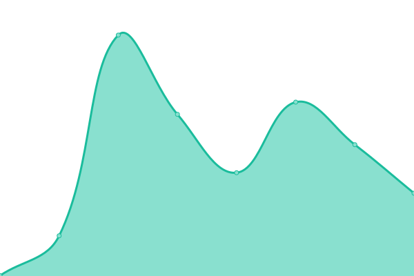 618ms
     
 | 

<a href="https://Haoqi7.github.io/uptime/history/let-s-cook">100.00%</a>
    

|  [File Transfer](https://code.haoqiyong.cf/) | 🟩 Up | [file-transfer.yml](https://github.com/Haoqi7/uptime/commits/HEAD/history/file-transfer.yml) | 

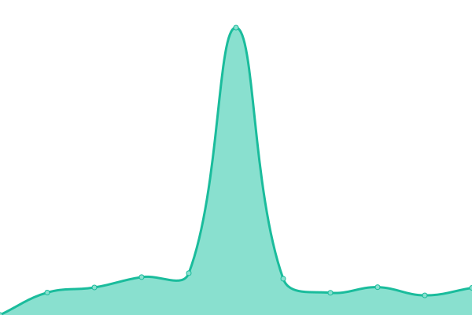 1022ms
     
 | 

<a href="https://Haoqi7.github.io/uptime/history/file-transfer">100.00%</a>
    

|  [File文件传递柜](https://file.haoda7.repl.co) | 🟩 Up | [file.yml](https://github.com/Haoqi7/uptime/commits/HEAD/history/file.yml) | 

 346ms
     
 | 

<a href="https://Haoqi7.github.io/uptime/history/file">100.00%</a>
    

|  [memos备忘录](https://memos-on-replit.hao77.repl.co/) | 🟩 Up | [memos.yml](https://github.com/Haoqi7/uptime/commits/HEAD/history/memos.yml) | 

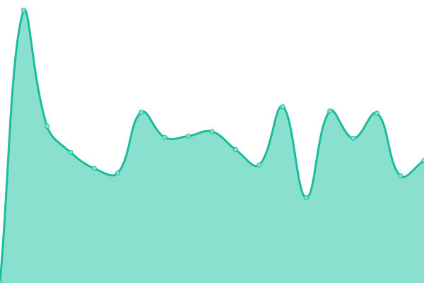 662ms
     
 | 

<a href="https://Haoqi7.github.io/uptime/history/memos">100.00%</a>
    

|  [Note便签](https://note.haoqiyun.ml/) | 🟩 Up | [note.yml](https://github.com/Haoqi7/uptime/commits/HEAD/history/note.yml) | 

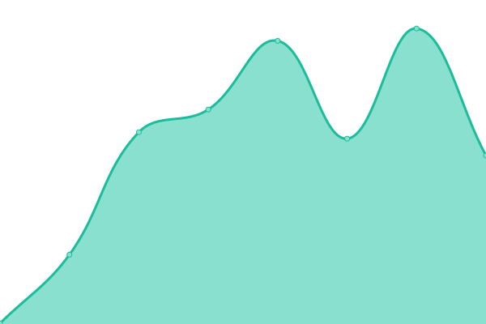 448ms
     
 | 

<a href="https://Haoqi7.github.io/uptime/history/note">100.00%</a>
    

|  [Bill账单](https://bill.wasenk.cf/) | 🟩 Up | [bill.yml](https://github.com/Haoqi7/uptime/commits/HEAD/history/bill.yml) | 

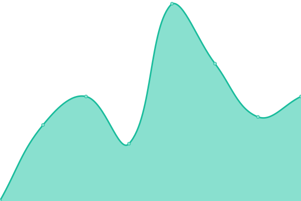 293ms
     
 | 

<a href="https://Haoqi7.github.io/uptime/history/bill">100.00%</a>
    

|  [All网盘搜索](https://search.haoqiyun.ml/) | 🟩 Up | [all.yml](https://github.com/Haoqi7/uptime/commits/HEAD/history/all.yml) | 

 283ms
     
 | 

<a href="https://Haoqi7.github.io/uptime/history/all">100.00%</a>
    

|  [One网盘](https://pan.haoqiyun.tk/) | 🟩 Up | [one.yml](https://github.com/Haoqi7/uptime/commits/HEAD/history/one.yml) | 

 1295ms
     
 | 

<a href="https://Haoqi7.github.io/uptime/history/one">100.00%</a>
    

|  [OneDrive](https://pan.wasenk.cf/zh-CN/) | 🟩 Up | [one-drive.yml](https://github.com/Haoqi7/uptime/commits/HEAD/history/one-drive.yml) | 

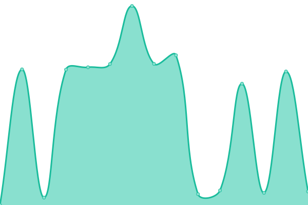 886ms
     
 | 

<a href="https://Haoqi7.github.io/uptime/history/one-drive">100.00%</a>
    

|  [Alist网盘](https://pan.haoda7.repl.co/) | 🟩 Up | [alist.yml](https://github.com/Haoqi7/uptime/commits/HEAD/history/alist.yml) | 

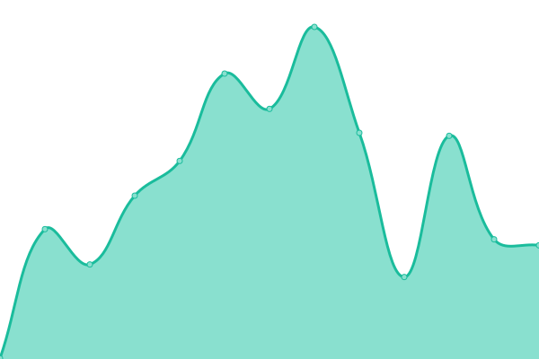 379ms
     
 | 

<a href="https://Haoqi7.github.io/uptime/history/alist">100.00%</a>
    

|  [Cloudreve 网盘](https://one.haoda.repl.co/) | 🟩 Up | [cloudreve.yml](https://github.com/Haoqi7/uptime/commits/HEAD/history/cloudreve.yml) | 

 333ms
     
 | 

<a href="https://Haoqi7.github.io/uptime/history/cloudreve">100.00%</a>
    

|  [Stable Diffusion](https://haoqi7-images.hf.space/) | 🟩 Up | [stable-diffusion.yml](https://github.com/Haoqi7/uptime/commits/HEAD/history/stable-diffusion.yml) | 

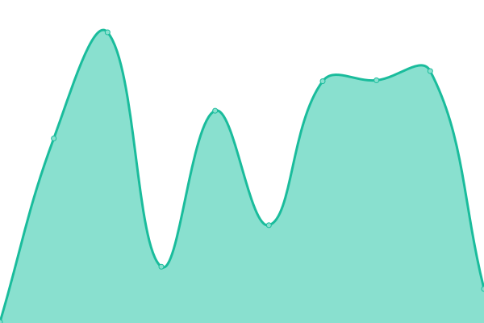 306ms
     
 | 

<a href="https://Haoqi7.github.io/uptime/history/stable-diffusion">100.00%</a>
    

|  [SearchIEEE文献](https://haoqi7-research.hf.space/) | 🟩 Up | [search-ieee.yml](https://github.com/Haoqi7/uptime/commits/HEAD/history/search-ieee.yml) | 

 251ms
     
 | 

<a href="https://Haoqi7.github.io/uptime/history/search-ieee">100.00%</a>
    

|  [AI对话](https://haoqi7-question.hf.space/) | 🟩 Up | [ai.yml](https://github.com/Haoqi7/uptime/commits/HEAD/history/ai.yml) | 

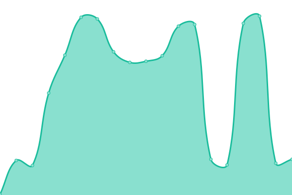 248ms
     
 | 

<a href="https://Haoqi7.github.io/uptime/history/ai">100.00%</a>
    

|  [AI绘画](https://haoqi7-draw.hf.space/) | 🟩 Up | [ai.yml](https://github.com/Haoqi7/uptime/commits/HEAD/history/ai.yml) | 

 248ms
     
 | 

<a href="https://Haoqi7.github.io/uptime/history/ai">100.00%</a>
    

|  [Chat匿名聊天](https://chat.hao77.repl.co/) | 🟩 Up | [chat.yml](https://github.com/Haoqi7/uptime/commits/HEAD/history/chat.yml) | 

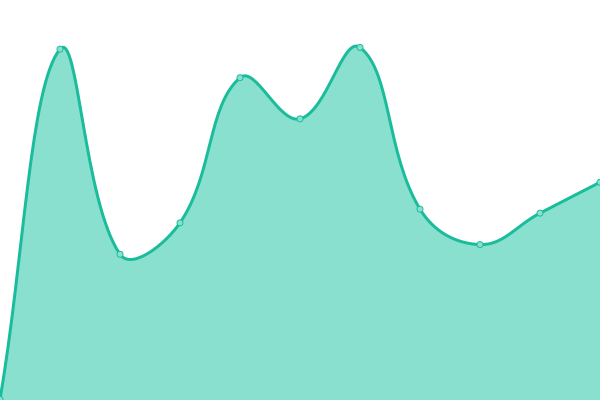 408ms
     
 | 

<a href="https://Haoqi7.github.io/uptime/history/chat">100.00%</a>
    

|  [Google Search](https://google.haoqiyun.tk/) | 🟩 Up | [google-search.yml](https://github.com/Haoqi7/uptime/commits/HEAD/history/google-search.yml) | 

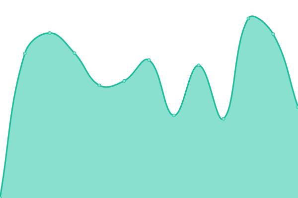 1146ms
     
 | 

<a href="https://Haoqi7.github.io/uptime/history/google-search">100.00%</a>
    

|  [Typecho博客](https://blog.haoqiyong.cf/) | 🟩 Up | [typecho.yml](https://github.com/Haoqi7/uptime/commits/HEAD/history/typecho.yml) | 

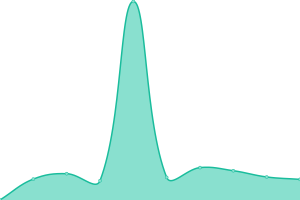 687ms
     
 | 

<a href="https://Haoqi7.github.io/uptime/history/typecho">99.79%</a>
    

|  [Butterfly博客](https://haoqiyun.tk/) | 🟩 Up | [butterfly.yml](https://github.com/Haoqi7/uptime/commits/HEAD/history/butterfly.yml) | 

 258ms
     
 | 

<a href="https://Haoqi7.github.io/uptime/history/butterfly">100.00%</a>
    

|  [Matery博客](https://www.haoqiyung.ml/) | 🟩 Up | [matery.yml](https://github.com/Haoqi7/uptime/commits/HEAD/history/matery.yml) | 

 318ms
     
 | 

<a href="https://Haoqi7.github.io/uptime/history/matery">100.00%</a>
    

|  [Rabbit博客](https://haoqiyun.ml/) | 🟩 Up | [rabbit.yml](https://github.com/Haoqi7/uptime/commits/HEAD/history/rabbit.yml) | 

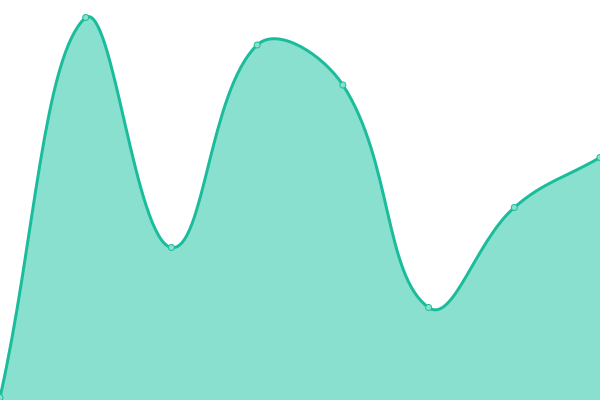 253ms
     
 | 

<a href="https://Haoqi7.github.io/uptime/history/rabbit">100.00%</a>
    

|  [NAS-state](https://nas.wasenk.cf) | 🟩 Up | [nas-state.yml](https://github.com/Haoqi7/uptime/commits/HEAD/history/nas-state.yml) | 

 321ms
     
 | 

<a href="https://Haoqi7.github.io/uptime/history/nas-state">100.00%</a>
    

|  [My文档](https://wasenk.cf) | 🟩 Up | [my.yml](https://github.com/Haoqi7/uptime/commits/HEAD/history/my.yml) | 

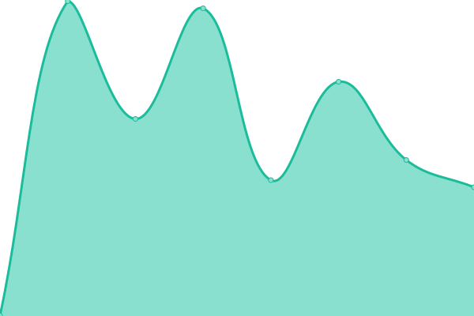 482ms
     
 | 

<a href="https://Haoqi7.github.io/uptime/history/my">100.00%</a>
    

|  [Chinese诗歌](https://haoqi7.github.io/poetry/) | 🟩 Up | [chinese.yml](https://github.com/Haoqi7/uptime/commits/HEAD/history/chinese.yml) | 

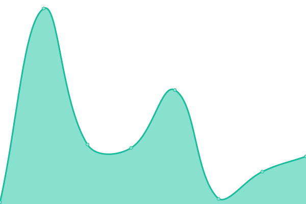 172ms
     
 | 

<a href="https://Haoqi7.github.io/uptime/history/chinese">100.00%</a>
    

|  [EverydayNews](https://haoqi7.github.io/EverydayNews) | 🟩 Up | [everyday-news.yml](https://github.com/Haoqi7/uptime/commits/HEAD/history/everyday-news.yml) | 

 143ms
     
 | 

<a href="https://Haoqi7.github.io/uptime/history/everyday-news">100.00%</a>
    

|  [Day's早报](https://news.haoqiyun.ml/) | 🟩 Up | [day-s.yml](https://github.com/Haoqi7/uptime/commits/HEAD/history/day-s.yml) | 

 234ms
     
 | 

<a href="https://Haoqi7.github.io/uptime/history/day-s">100.00%</a>
    

|  [Weibo热搜榜](https://haoqi7.github.io/weibo-search/) | 🟩 Up | [weibo.yml](https://github.com/Haoqi7/uptime/commits/HEAD/history/weibo.yml) | 

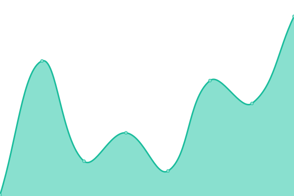 143ms
     
 | 

<a href="https://Haoqi7.github.io/uptime/history/weibo">100.00%</a>
    

|  [Book search](https://book.haoda7.repl.co/) | 🟩 Up | [book-search.yml](https://github.com/Haoqi7/uptime/commits/HEAD/history/book-search.yml) | 

 394ms
     
 | 

<a href="https://Haoqi7.github.io/uptime/history/book-search">100.00%</a>
    

|  [Online reader](https://reader.hao77.repl.co/) | 🟩 Up | [online-reader.yml](https://github.com/Haoqi7/uptime/commits/HEAD/history/online-reader.yml) | 

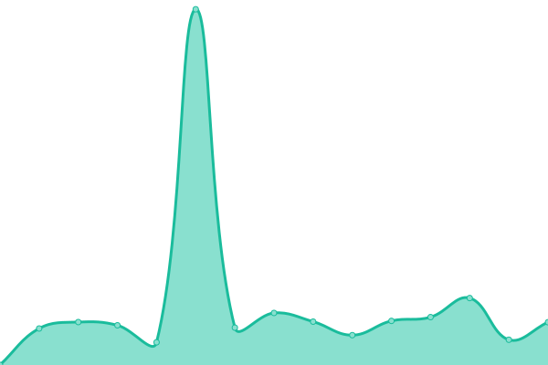 379ms
     
 | 

<a href="https://Haoqi7.github.io/uptime/history/online-reader">100.00%</a>
    

|  [Nav导航网站](https://nav.haoqiyun.ml/) | 🟩 Up | [nav.yml](https://github.com/Haoqi7/uptime/commits/HEAD/history/nav.yml) | 

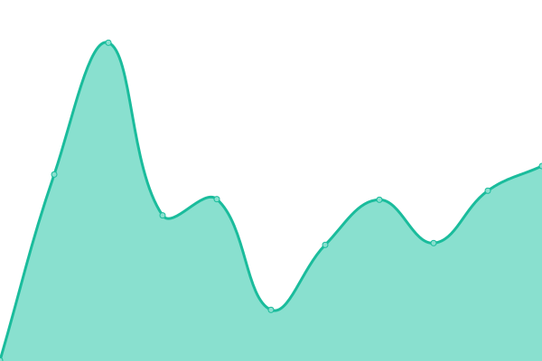 240ms
     
 | 

<a href="https://Haoqi7.github.io/uptime/history/nav">100.00%</a>
    

|  [Learn Only导航](https://nav.wasenk.cf/) | 🟩 Up | [learn-only.yml](https://github.com/Haoqi7/uptime/commits/HEAD/history/learn-only.yml) | 

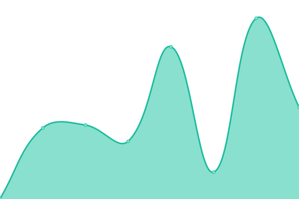 245ms
     
 | 

<a href="https://Haoqi7.github.io/uptime/history/learn-only">100.00%</a>
    

|  [Games合集](https://game.haoqiyun.tk/) | 🟩 Up | [games.yml](https://github.com/Haoqi7/uptime/commits/HEAD/history/games.yml) | 

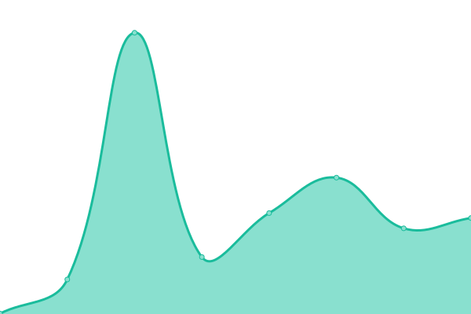 237ms
     
 | 

<a href="https://Haoqi7.github.io/uptime/history/games">100.00%</a>
    

|  [five-Chess](https://haoqi7.github.io/five-Chess/) | 🟩 Up | [five-chess.yml](https://github.com/Haoqi7/uptime/commits/HEAD/history/five-chess.yml) | 

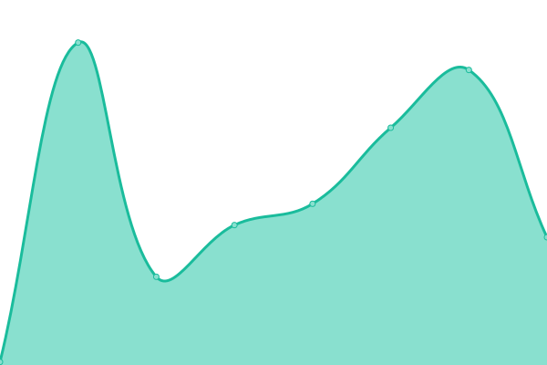 156ms
     
 | 

<a href="https://Haoqi7.github.io/uptime/history/five-chess">100.00%</a>
    

|  [Chinese-chess](https://haoqi7.github.io/Chinese-chess) | 🟩 Up | [chinese-chess.yml](https://github.com/Haoqi7/uptime/commits/HEAD/history/chinese-chess.yml) | 

 137ms
     
 | 

<a href="https://Haoqi7.github.io/uptime/history/chinese-chess">100.00%</a>
    

|  [catch-cat](https://haoqi7.github.io/catch-cat) | 🟩 Up | [catch-cat.yml](https://github.com/Haoqi7/uptime/commits/HEAD/history/catch-cat.yml) | 

 147ms
     
 | 

<a href="https://Haoqi7.github.io/uptime/history/catch-cat">100.00%</a>
    

|  [Music](https://music.haoqiyong.cf) | 🟩 Up | [music.yml](https://github.com/Haoqi7/uptime/commits/HEAD/history/music.yml) | 

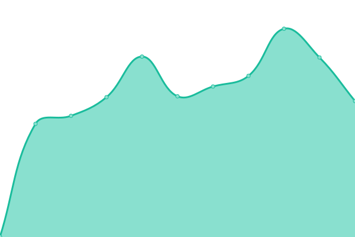 549ms
     
 | 

<a href="https://Haoqi7.github.io/uptime/history/music">100.00%</a>
    

|  [YesPlayMusic](https://music.wasenk.cf/) | 🟩 Up | [yes-play-music.yml](https://github.com/Haoqi7/uptime/commits/HEAD/history/yes-play-music.yml) | 

 271ms
     
 | 

<a href="https://Haoqi7.github.io/uptime/history/yes-play-music">100.00%</a>
    

|  [BiYingWallPaper](https://haoqi7.github.io/BiYingWallPaper/) | 🟩 Up | [bi-ying-wall-paper.yml](https://github.com/Haoqi7/uptime/commits/HEAD/history/bi-ying-wall-paper.yml) | 

 120ms
     
 | 

<a href="https://Haoqi7.github.io/uptime/history/bi-ying-wall-paper">100.00%</a>
    

|  [GitHub文件加速](https://git.haoqiyong.cf/) | 🟩 Up | [git-hub.yml](https://github.com/Haoqi7/uptime/commits/HEAD/history/git-hub.yml) | 

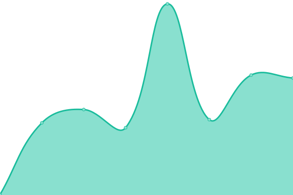 476ms
     
 | 

<a href="https://Haoqi7.github.io/uptime/history/git-hub">100.00%</a>
    

|  [OneLine Tool](https://haoqi7.github.io/online-tools/) | 🟩 Up | [one-line-tool.yml](https://github.com/Haoqi7/uptime/commits/HEAD/history/one-line-tool.yml) | 

 109ms
     
 | 

<a href="https://Haoqi7.github.io/uptime/history/one-line-tool">100.00%</a>
    

|  [online抠图](https://image.haoqi7.repl.co/) | 🟩 Up | [online.yml](https://github.com/Haoqi7/uptime/commits/HEAD/history/online.yml) | 

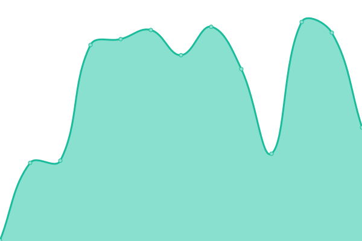 956ms
     
 | 

<a href="https://Haoqi7.github.io/uptime/history/online">99.64%</a>
    

|  [TUku](https://tu.hao77.repl.co/) | 🟩 Up | [t-uku.yml](https://github.com/Haoqi7/uptime/commits/HEAD/history/t-uku.yml) | 

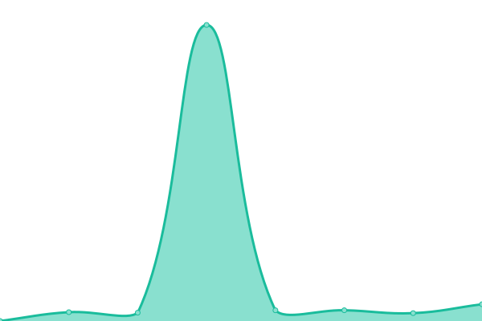 440ms
     
 | 

<a href="https://Haoqi7.github.io/uptime/history/t-uku">100.00%</a>
    

|  [uptime](https://uptime.haoda.repl.co/) | 🟩 Up | [uptime.yml](https://github.com/Haoqi7/uptime/commits/HEAD/history/uptime.yml) | 

 3417ms
     
 | 

<a href="https://Haoqi7.github.io/uptime/history/uptime">98.58%</a>
    

|  [API代理](https://proxy.haoqiyun.tk/) | 🟩 Up | [api.yml](https://github.com/Haoqi7/uptime/commits/HEAD/history/api.yml) | 

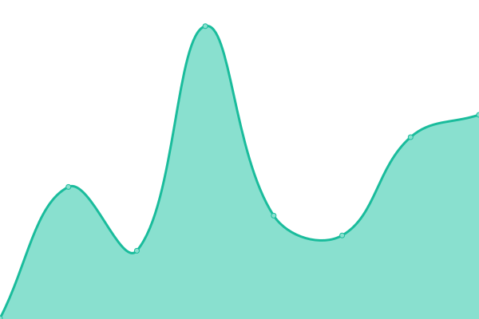 264ms
     
 | 

<a href="https://Haoqi7.github.io/uptime/history/api">100.00%</a>
    

|  [rsshub](https://rss.haoqiyung.ml/) | 🟩 Up | [rsshub.yml](https://github.com/Haoqi7/uptime/commits/HEAD/history/rsshub.yml) | 

 3411ms
     
 | 

<a href="https://Haoqi7.github.io/uptime/history/rsshub">100.00%</a>
    

|  [Translate](https://translate.haoqiyung.ml) | 🟩 Up | [translate.yml](https://github.com/Haoqi7/uptime/commits/HEAD/history/translate.yml) | 

 295ms
     
 | 

<a href="https://Haoqi7.github.io/uptime/history/translate">100.00%</a>
    

|  [Deepl](https://deep.haoda.repl.co/) | 🟩 Up | [deepl.yml](https://github.com/Haoqi7/uptime/commits/HEAD/history/deepl.yml) | 

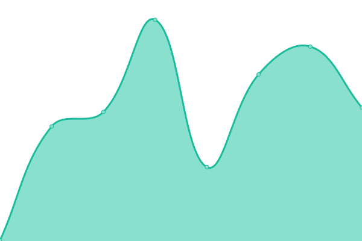 784ms
     
 | 

<a href="https://Haoqi7.github.io/uptime/history/deepl">100.00%</a>
    

|  [Deeplx](https://deep.haoda7.repl.co/) | 🟩 Up | [deeplx.yml](https://github.com/Haoqi7/uptime/commits/HEAD/history/deeplx.yml) | 

 336ms
     
 | 

<a href="https://Haoqi7.github.io/uptime/history/deeplx">100.00%</a>
    

|  [fy](https://fy.haoda.repl.co/) | 🟩 Up | [fy.yml](https://github.com/Haoqi7/uptime/commits/HEAD/history/fy.yml) | 

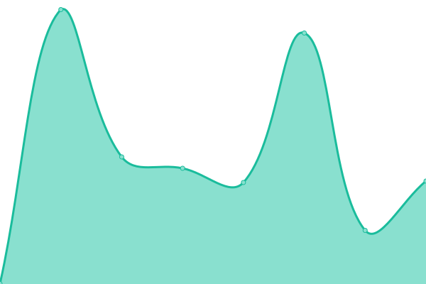 355ms
     
 | 

<a href="https://Haoqi7.github.io/uptime/history/fy">100.00%</a>
    

|  [Bing Straslate API](https://fy.haoda7.repl.co/) | 🟩 Up | [bing-straslate-api.yml](https://github.com/Haoqi7/uptime/commits/HEAD/history/bing-straslate-api.yml) | 

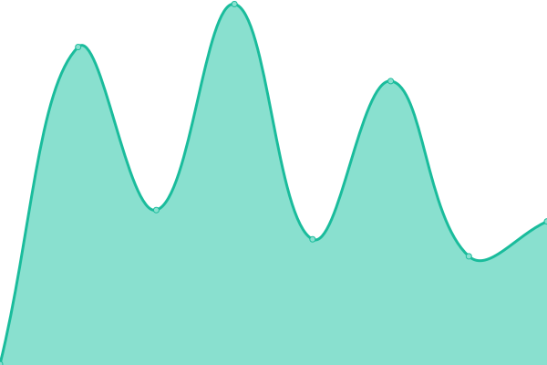 373ms
     
 | 

<a href="https://Haoqi7.github.io/uptime/history/bing-straslate-api">100.00%</a>
    

|  [TXT-convert](https://haoqiyung.github.io/web-txt-convert/) | 🟩 Up | [txt-convert.yml](https://github.com/Haoqi7/uptime/commits/HEAD/history/txt-convert.yml) | 

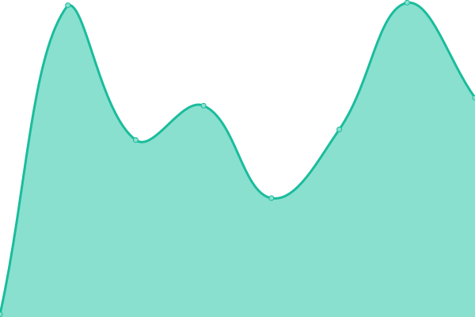 325ms
     
 | 

<a href="https://Haoqi7.github.io/uptime/history/txt-convert">100.00%</a>
    

|  [Ipfs](https://haoqiyung.ml/ipfs/) | 🟩 Up | [ipfs.yml](https://github.com/Haoqi7/uptime/commits/HEAD/history/ipfs.yml) | 

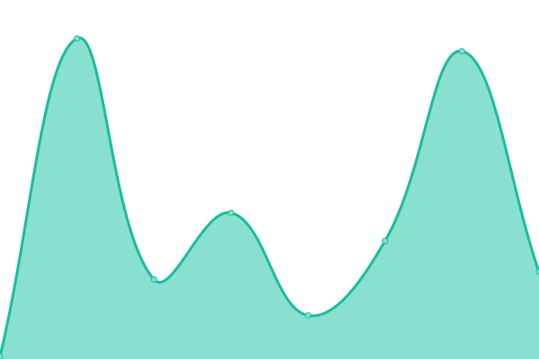 71ms
     
 | 

<a href="https://Haoqi7.github.io/uptime/history/ipfs">100.00%</a>
    

|  [cs](https://cs.haoqiyong.cf) | 🟩 Up | [cs.yml](https://github.com/Haoqi7/uptime/commits/HEAD/history/cs.yml) | 

 1325ms
     
 | 

<a href="https://Haoqi7.github.io/uptime/history/cs">100.00%</a>
    

|  [count不蒜子](https://count.haoqi7.repl.co/) | 🟩 Up | [count.yml](https://github.com/Haoqi7/uptime/commits/HEAD/history/count.yml) | 

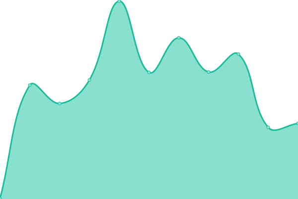 605ms
     
 | 

<a href="https://Haoqi7.github.io/uptime/history/count">99.31%</a>
    

<!--end: status pages-->

[**Visit our status website →**](https://Haoqi7.github.io/uptime)

## 📄 License

- Code: [MIT](./LICENSE) © [Haoqi7](https://Haoqi7.github.io/uptime)
- Data in the `./history` directory: [Open Database License](https://opendatacommons.org/licenses/odbl/1-0/)
