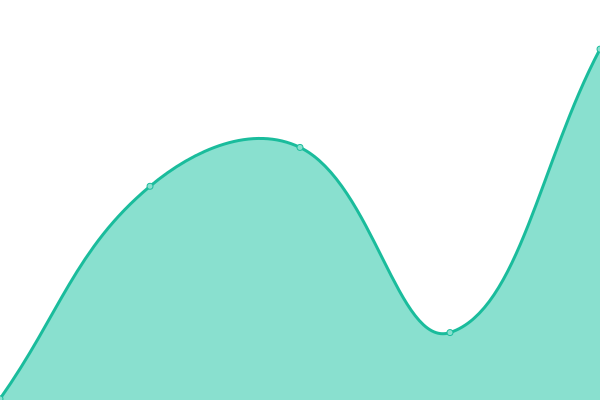
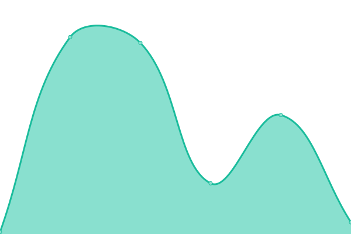
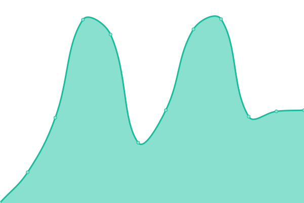

# [📈 Live Status](https://Haoqi7.github.io/uptime): <!--live status--> **🟩 All systems operational**

This repository contains the open-source uptime monitor and status page for [Haoqi7](https://Haoqi7.github.io/uptime), powered by [Upptime](https://github.com/upptime/upptime).

With [Upptime](https://upptime.js.org), you can get your own unlimited and free uptime monitor and status page, powered entirely by a GitHub repository. We use [Issues](https://github.com/Haoqi7/uptime/issues) as incident reports, [Actions](https://github.com/Haoqi7/uptime/actions) as uptime monitors, and [Pages](https://Haoqi7.github.io/uptime) for the status page.

<!--start: status pages-->
<!-- This summary is generated by Upptime (https://github.com/upptime/upptime) -->
<!-- Do not edit this manually, your changes will be overwritten -->
<!-- prettier-ignore -->
| URL | Status | History | Response Time | Uptime |
| --- | ------ | ------- | ------------- | ------ |
|  [File Transfer](https://code.haoqiyong.cf/) | 🟩 Up | [file-transfer.yml](https://github.com/Haoqi7/uptime/commits/HEAD/history/file-transfer.yml) | 

 611ms
     
 | 

<a href="https://Haoqi7.github.io/uptime/history/file-transfer">100.00%</a>
    

|  [memos备忘录](https://write.haoqiyong.cf/) | 🟩 Up | [memos.yml](https://github.com/Haoqi7/uptime/commits/HEAD/history/memos.yml) | 

 1350ms
     
 | 

<a href="https://Haoqi7.github.io/uptime/history/memos">100.00%</a>
    

|  [便签](https://note.haoqiyun.ml/) | 🟩 Up | [.yml](https://github.com/Haoqi7/uptime/commits/HEAD/history/.yml) | 

 539ms
     
 | 

<a href="https://Haoqi7.github.io/uptime/history/">100.00%</a>
    

|  [Bill账单](https://bill.wasenk.cf/) | 🟩 Up | [bill.yml](https://github.com/Haoqi7/uptime/commits/HEAD/history/bill.yml) | 

 355ms
     
 | 

<a href="https://Haoqi7.github.io/uptime/history/bill">100.00%</a>
    

|  [网盘搜索](https://search.haoqiyun.ml/) | 🟩 Up | [.yml](https://github.com/Haoqi7/uptime/commits/HEAD/history/.yml) | 

 539ms
     
 | 

<a href="https://Haoqi7.github.io/uptime/history/">100.00%</a>
    

|  [One网盘](https://www.haoqiyun.tk/) | 🟩 Up | [one.yml](https://github.com/Haoqi7/uptime/commits/HEAD/history/one.yml) | 

 1590ms
     
 | 

<a href="https://Haoqi7.github.io/uptime/history/one">100.00%</a>
    

|  [OneDrive](https://pan.wasenk.cf/zh-CN/) | 🟩 Up | [one-drive.yml](https://github.com/Haoqi7/uptime/commits/HEAD/history/one-drive.yml) | 

 633ms
     
 | 

<a href="https://Haoqi7.github.io/uptime/history/one-drive">100.00%</a>
    

|  [BP3网盘](http://nav.midfegh.tk/) | 🟩 Up | [bp-3.yml](https://github.com/Haoqi7/uptime/commits/HEAD/history/bp-3.yml) | 

 2974ms
     
 | 

<a href="https://Haoqi7.github.io/uptime/history/bp-3">100.00%</a>
    

|  [Alist网盘](https://pan.haoqiyong.cf) | 🟩 Up | [alist.yml](https://github.com/Haoqi7/uptime/commits/HEAD/history/alist.yml) | 

 596ms
     
 | 

<a href="https://Haoqi7.github.io/uptime/history/alist">100.00%</a>
    

|  [Stable Diffusion](https://haoqi7-images.hf.space/) | 🟩 Up | [stable-diffusion.yml](https://github.com/Haoqi7/uptime/commits/HEAD/history/stable-diffusion.yml) | 

 200ms
     
 | 

<a href="https://Haoqi7.github.io/uptime/history/stable-diffusion">100.00%</a>
    

|  [检索IEEE文献](https://haoqi7-research.hf.space/) | 🟩 Up | [ieee.yml](https://github.com/Haoqi7/uptime/commits/HEAD/history/ieee.yml) | 

 187ms
     
 | 

<a href="https://Haoqi7.github.io/uptime/history/ieee">100.00%</a>
    

|  [AI对话](https://haoqi7-question.hf.space/) | 🟩 Up | [ai.yml](https://github.com/Haoqi7/uptime/commits/HEAD/history/ai.yml) | 

 190ms
     
 | 

<a href="https://Haoqi7.github.io/uptime/history/ai">100.00%</a>
    

|  [AI绘画](https://haoqi7-draw.hf.space/) | 🟩 Up | [ai.yml](https://github.com/Haoqi7/uptime/commits/HEAD/history/ai.yml) | 

 190ms
     
 | 

<a href="https://Haoqi7.github.io/uptime/history/ai">100.00%</a>
    

|  [匿名聊天](https://chat.haoqi7.repl.co) | 🟩 Up | [.yml](https://github.com/Haoqi7/uptime/commits/HEAD/history/.yml) | 

 539ms
     
 | 

<a href="https://Haoqi7.github.io/uptime/history/">100.00%</a>
    

|  [在线API](http://api.midfegh.tk/) | 🟩 Up | [api.yml](https://github.com/Haoqi7/uptime/commits/HEAD/history/api.yml) | 

 2678ms
     
 | 

<a href="https://Haoqi7.github.io/uptime/history/api">100.00%</a>
    

|  [Google Scholar](https://scholar.haoqiyun.tk/) | 🟩 Up | [google-scholar.yml](https://github.com/Haoqi7/uptime/commits/HEAD/history/google-scholar.yml) | 

 759ms
     
 | 

<a href="https://Haoqi7.github.io/uptime/history/google-scholar">100.00%</a>
    

|  [Google Search](https://google.haoqiyun.tk/) | 🟩 Up | [google-search.yml](https://github.com/Haoqi7/uptime/commits/HEAD/history/google-search.yml) | 

 1766ms
     
 | 

<a href="https://Haoqi7.github.io/uptime/history/google-search">100.00%</a>
    

|  [Blog博客](https://blog.haoqiyong.cf/) | 🟩 Up | [blog.yml](https://github.com/Haoqi7/uptime/commits/HEAD/history/blog.yml) | 

 601ms
     
 | 

<a href="https://Haoqi7.github.io/uptime/history/blog">100.00%</a>
    

|  [思想加油站](https://haoqiyun.tk/) | 🟩 Up | [.yml](https://github.com/Haoqi7/uptime/commits/HEAD/history/.yml) | 

 539ms
     
 | 

<a href="https://Haoqi7.github.io/uptime/history/">100.00%</a>
    

|  [好好学习拔](https://www.haoqiyung.ml/) | 🟩 Up | [.yml](https://github.com/Haoqi7/uptime/commits/HEAD/history/.yml) | 

 539ms
     
 | 

<a href="https://Haoqi7.github.io/uptime/history/">100.00%</a>
    

|  [中文诗歌](https://haoqi7.github.io/poetry/) | 🟩 Up | [.yml](https://github.com/Haoqi7/uptime/commits/HEAD/history/.yml) | 

 539ms
     
 | 

<a href="https://Haoqi7.github.io/uptime/history/">100.00%</a>
    

|  [每日新闻](https://haoqi7.github.io/EverydayNews) | 🟩 Up | [.yml](https://github.com/Haoqi7/uptime/commits/HEAD/history/.yml) | 

 539ms
     
 | 

<a href="https://Haoqi7.github.io/uptime/history/">100.00%</a>
    

|  [每日早报](https://news.haoqiyun.ml/) | 🟩 Up | [.yml](https://github.com/Haoqi7/uptime/commits/HEAD/history/.yml) | 

 539ms
     
 | 

<a href="https://Haoqi7.github.io/uptime/history/">100.00%</a>
    

|  [知乎热搜榜](https://haoqi7.github.io/zhihu-search/) | 🟩 Up | [.yml](https://github.com/Haoqi7/uptime/commits/HEAD/history/.yml) | 

 539ms
     
 | 

<a href="https://Haoqi7.github.io/uptime/history/">100.00%</a>
    

|  [微博热搜榜](https://haoqi7.github.io/weibo-search/) | 🟩 Up | [.yml](https://github.com/Haoqi7/uptime/commits/HEAD/history/.yml) | 

 539ms
     
 | 

<a href="https://Haoqi7.github.io/uptime/history/">100.00%</a>
    

|  [在线阅读](https://reader.haoqiyong.cf/) | 🟩 Up | [.yml](https://github.com/Haoqi7/uptime/commits/HEAD/history/.yml) | 

 539ms
     
 | 

<a href="https://Haoqi7.github.io/uptime/history/">100.00%</a>
    

|  [知乎小说](https://haoqi7.github.io/zhihu) | 🟩 Up | [.yml](https://github.com/Haoqi7/uptime/commits/HEAD/history/.yml) | 

 539ms
     
 | 

<a href="https://Haoqi7.github.io/uptime/history/">100.00%</a>
    

|  [导航网站](https://nav.haoqiyun.ml/) | 🟩 Up | [.yml](https://github.com/Haoqi7/uptime/commits/HEAD/history/.yml) | 

 539ms
     
 | 

<a href="https://Haoqi7.github.io/uptime/history/">100.00%</a>
    

|  [Learn Only导航](https://nav.wasenk.cf/) | 🟩 Up | [learn-only.yml](https://github.com/Haoqi7/uptime/commits/HEAD/history/learn-only.yml) | 

 355ms
     
 | 

<a href="https://Haoqi7.github.io/uptime/history/learn-only">100.00%</a>
    

|  [Games合集](https://game.haoqiyun.tk/) | 🟩 Up | [games.yml](https://github.com/Haoqi7/uptime/commits/HEAD/history/games.yml) | 

 378ms
     
 | 

<a href="https://Haoqi7.github.io/uptime/history/games">100.00%</a>
    

|  [五子棋](https://haoqi7.github.io/five-Chess/) | 🟩 Up | [.yml](https://github.com/Haoqi7/uptime/commits/HEAD/history/.yml) | 

 539ms
     
 | 

<a href="https://Haoqi7.github.io/uptime/history/">100.00%</a>
    

|  [象棋](https://haoqi7.github.io/Chinese-chess) | 🟩 Up | [.yml](https://github.com/Haoqi7/uptime/commits/HEAD/history/.yml) | 

 539ms
     
 | 

<a href="https://Haoqi7.github.io/uptime/history/">100.00%</a>
    

|  [抓猫猫](https://haoqi7.github.io/catch-cat) | 🟩 Up | [.yml](https://github.com/Haoqi7/uptime/commits/HEAD/history/.yml) | 

 539ms
     
 | 

<a href="https://Haoqi7.github.io/uptime/history/">100.00%</a>
    

|  [YesPlayMusic](https://music.wasenk.cf/) | 🟩 Up | [yes-play-music.yml](https://github.com/Haoqi7/uptime/commits/HEAD/history/yes-play-music.yml) | 

 809ms
     
 | 

<a href="https://Haoqi7.github.io/uptime/history/yes-play-music">100.00%</a>
    

|  [BiYingWallPaper](https://haoqi7.github.io/BiYingWallPaper/) | 🟩 Up | [bi-ying-wall-paper.yml](https://github.com/Haoqi7/uptime/commits/HEAD/history/bi-ying-wall-paper.yml) | 

 231ms
     
 | 

<a href="https://Haoqi7.github.io/uptime/history/bi-ying-wall-paper">100.00%</a>
    

|  [在线壁纸](http://wa11.vercel.app/) | 🟩 Up | [.yml](https://github.com/Haoqi7/uptime/commits/HEAD/history/.yml) | 

 539ms
     
 | 

<a href="https://Haoqi7.github.io/uptime/history/">100.00%</a>
    

|  [GitHub文件加速1](https://haoqi7.github.io/gh-proxy/) | 🟩 Up | [git-hub-1.yml](https://github.com/Haoqi7/uptime/commits/HEAD/history/git-hub-1.yml) | 

 101ms
     
 | 

<a href="https://Haoqi7.github.io/uptime/history/git-hub-1">100.00%</a>
    

|  [GitHub文件加速2](https://git.haoqiyong.cf/) | 🟩 Up | [git-hub-2.yml](https://github.com/Haoqi7/uptime/commits/HEAD/history/git-hub-2.yml) | 

 372ms
     
 | 

<a href="https://Haoqi7.github.io/uptime/history/git-hub-2">100.00%</a>
    

|  [OneLine Tool](https://haoqi7.github.io/online-tools/) | 🟩 Up | [one-line-tool.yml](https://github.com/Haoqi7/uptime/commits/HEAD/history/one-line-tool.yml) | 

 111ms
     
 | 

<a href="https://Haoqi7.github.io/uptime/history/one-line-tool">100.00%</a>
    

|  [在线抠图](https://image.haoqi7.repl.co/) | 🟩 Up | [.yml](https://github.com/Haoqi7/uptime/commits/HEAD/history/.yml) | 

 539ms
     
 | 

<a href="https://Haoqi7.github.io/uptime/history/">100.00%</a>
    

|  [API代理](https://proxy.haoqiyun.tk/) | 🟩 Up | [api.yml](https://github.com/Haoqi7/uptime/commits/HEAD/history/api.yml) | 

 2678ms
     
 | 

<a href="https://Haoqi7.github.io/uptime/history/api">100.00%</a>
    

|  [rsshub](https://rss.haoqiyung.ml/) | 🟩 Up | [rsshub.yml](https://github.com/Haoqi7/uptime/commits/HEAD/history/rsshub.yml) | 

 3821ms
     
 | 

<a href="https://Haoqi7.github.io/uptime/history/rsshub">100.00%</a>
    

|  [vercel部署](https://haoqiyun.ml/ver/Vercel/Deploy.html) | 🟩 Up | [vercel.yml](https://github.com/Haoqi7/uptime/commits/HEAD/history/vercel.yml) | 

 94ms
     
 | 

<a href="https://Haoqi7.github.io/uptime/history/vercel">100.00%</a>
    

|  [count不蒜子](https://count.haoqi7.repl.co/) | 🟩 Up | [count.yml](https://github.com/Haoqi7/uptime/commits/HEAD/history/count.yml) | 

 427ms
     
 | 

<a href="https://Haoqi7.github.io/uptime/history/count">100.00%</a>
    

<!--end: status pages-->

[**Visit our status website →**](https://Haoqi7.github.io/uptime)

## 📄 License

- Code: [MIT](./LICENSE) © [Haoqi7](https://Haoqi7.github.io/uptime)
- Data in the `./history` directory: [Open Database License](https://opendatacommons.org/licenses/odbl/1-0/)
