# [📈 Live Status](https://Haoqi7.github.io/uptime): <!--live status--> **🟧 Partial outage**

This repository contains the open-source uptime monitor and status page for [Haoqi7](https://Haoqi7.github.io/uptime), powered by [Up time](https://github.com/upptime/upptime).

With [Upptime](https://upptime.js.org), you can get your own unlimited and free uptime monitor and status page, powered entirely by a GitHub repository. We use [Issues](https://github.com/Haoqi7/uptime/issues) as incident reports, [Actions](https://github.com/Haoqi7/uptime/actions) as uptime monitors, and [Pages](https://Haoqi7.github.io/uptime) for the status page.

<!--start: status pages-->
<!-- This summary is generated by Upptime (https://github.com/upptime/upptime) -->
<!-- Do not edit this manually, your changes will be overwritten -->
<!-- prettier-ignore -->
| URL | Status | History | Response Time | Uptime |
| --- | ------ | ------- | ------------- | ------ |
|  [Let's Cook](https://cook.wasenk.cf/) | 🟩 Up | [let-s-cook.yml](https://github.com/Haoqi7/uptime/commits/HEAD/history/let-s-cook.yml) | 

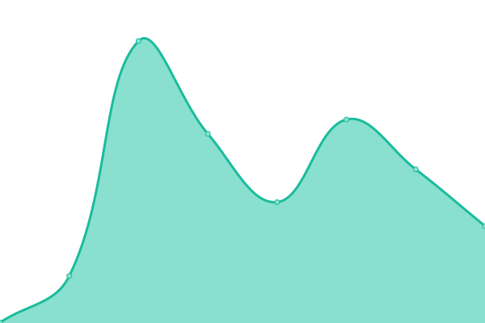 315ms
     
 | 

<a href="https://Haoqi7.github.io/uptime/history/let-s-cook">100.00%</a>
    

|  [push](https://server.haoqiyun.tk/) | 🟩 Up | [push.yml](https://github.com/Haoqi7/uptime/commits/HEAD/history/push.yml) | 

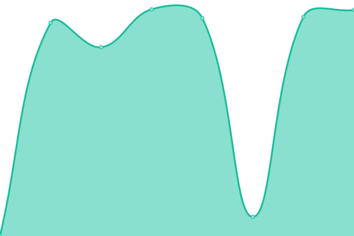 2345ms
     
 | 

<a href="https://Haoqi7.github.io/uptime/history/push">100.00%</a>
    

|  [Note便签](https://note.haoqiyun.tk/) | 🟩 Up | [note.yml](https://github.com/Haoqi7/uptime/commits/HEAD/history/note.yml) | 

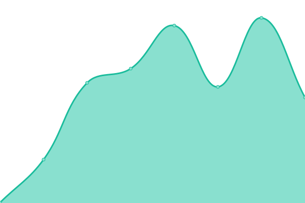 245ms
     
 | 

<a href="https://Haoqi7.github.io/uptime/history/note">100.00%</a>
    

|  [Bill账单](https://bill.wasenk.cf/) | 🟩 Up | [bill.yml](https://github.com/Haoqi7/uptime/commits/HEAD/history/bill.yml) | 

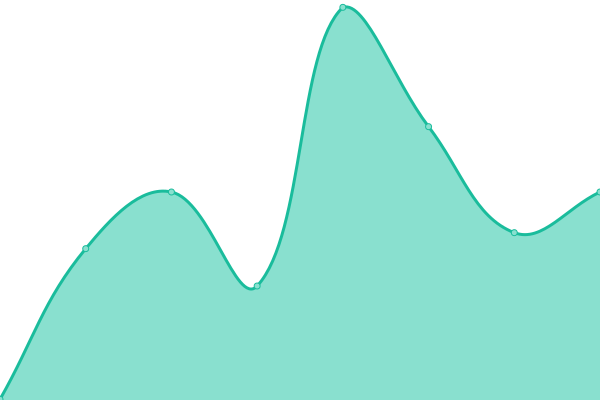 443ms
     
 | 

<a href="https://Haoqi7.github.io/uptime/history/bill">100.00%</a>
    

|  [All网盘搜索](https://search.haoqiyun.tk/) | 🟩 Up | [all.yml](https://github.com/Haoqi7/uptime/commits/HEAD/history/all.yml) | 

 310ms
     
 | 

<a href="https://Haoqi7.github.io/uptime/history/all">100.00%</a>
    

|  [Google Search](https://google.haoqiyun.tk/) | 🟥 Down | [google-search.yml](https://github.com/Haoqi7/uptime/commits/HEAD/history/google-search.yml) | 

 0ms
     
 | 

<a href="https://Haoqi7.github.io/uptime/history/google-search">0.00%</a>
    

|  [Butterfly博客](https://haoqiyun.tk/) | 🟩 Up | [butterfly.yml](https://github.com/Haoqi7/uptime/commits/HEAD/history/butterfly.yml) | 

 3021ms
     
 | 

<a href="https://Haoqi7.github.io/uptime/history/butterfly">100.00%</a>
    

|  [Matery博客](https://haoqiyung.github.io/) | 🟩 Up | [matery.yml](https://github.com/Haoqi7/uptime/commits/HEAD/history/matery.yml) | 

 125ms
     
 | 

<a href="https://Haoqi7.github.io/uptime/history/matery">100.00%</a>
    

|  [Rabbit博客](https://haoqi7.github.io/) | 🟩 Up | [rabbit.yml](https://github.com/Haoqi7/uptime/commits/HEAD/history/rabbit.yml) | 

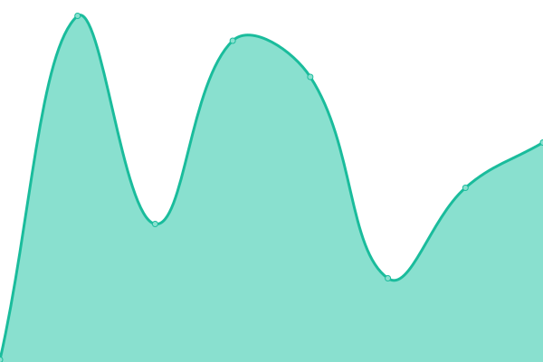 115ms
     
 | 

<a href="https://Haoqi7.github.io/uptime/history/rabbit">100.00%</a>
    

|  [NAS-state](https://nas-state.vercel.app/) | 🟩 Up | [nas-state.yml](https://github.com/Haoqi7/uptime/commits/HEAD/history/nas-state.yml) | 

 175ms
     
 | 

<a href="https://Haoqi7.github.io/uptime/history/nas-state">100.00%</a>
    

|  [My文档](https://wasenk.cf) | 🟩 Up | [my.yml](https://github.com/Haoqi7/uptime/commits/HEAD/history/my.yml) | 

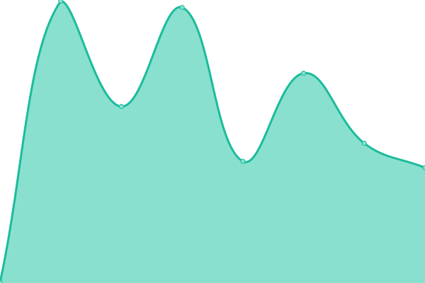 517ms
     
 | 

<a href="https://Haoqi7.github.io/uptime/history/my">100.00%</a>
    

|  [Chinese诗歌](https://haoqi7.github.io/poetry/) | 🟩 Up | [chinese.yml](https://github.com/Haoqi7/uptime/commits/HEAD/history/chinese.yml) | 

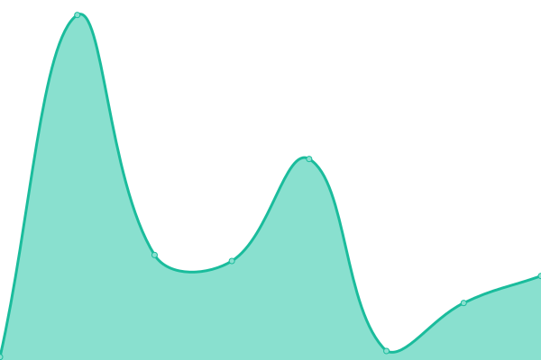 48ms
     
 | 

<a href="https://Haoqi7.github.io/uptime/history/chinese">100.00%</a>
    

|  [EverydayNews](https://haoqi7.github.io/EverydayNews) | 🟩 Up | [everyday-news.yml](https://github.com/Haoqi7/uptime/commits/HEAD/history/everyday-news.yml) | 

 84ms
     
 | 

<a href="https://Haoqi7.github.io/uptime/history/everyday-news">100.00%</a>
    

|  [Day's早报](https://news.haoqiyun.tk/) | 🟩 Up | [day-s.yml](https://github.com/Haoqi7/uptime/commits/HEAD/history/day-s.yml) | 

 224ms
     
 | 

<a href="https://Haoqi7.github.io/uptime/history/day-s">100.00%</a>
    

|  [Weibo热搜榜](https://haoqi7.github.io/weibo-search/) | 🟩 Up | [weibo.yml](https://github.com/Haoqi7/uptime/commits/HEAD/history/weibo.yml) | 

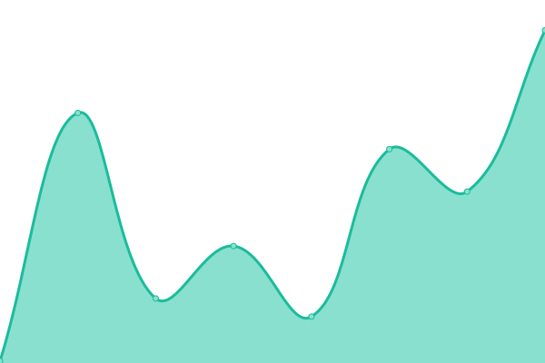 63ms
     
 | 

<a href="https://Haoqi7.github.io/uptime/history/weibo">100.00%</a>
    

|  [Learn Only导航](https://nav.wasenk.cf/) | 🟩 Up | [learn-only.yml](https://github.com/Haoqi7/uptime/commits/HEAD/history/learn-only.yml) | 

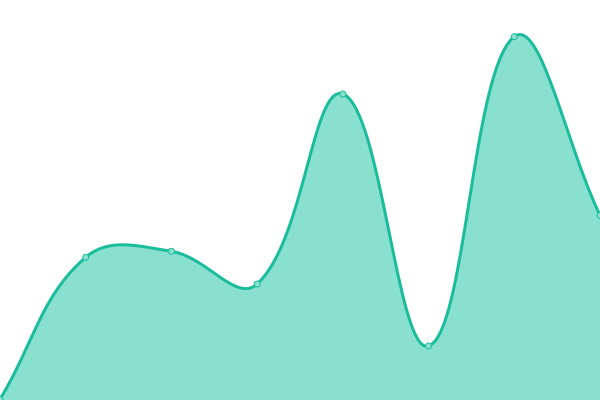 293ms
     
 | 

<a href="https://Haoqi7.github.io/uptime/history/learn-only">100.00%</a>
    

|  [Games合集](https://game.haoqiyun.tk/) | 🟩 Up | [games.yml](https://github.com/Haoqi7/uptime/commits/HEAD/history/games.yml) | 

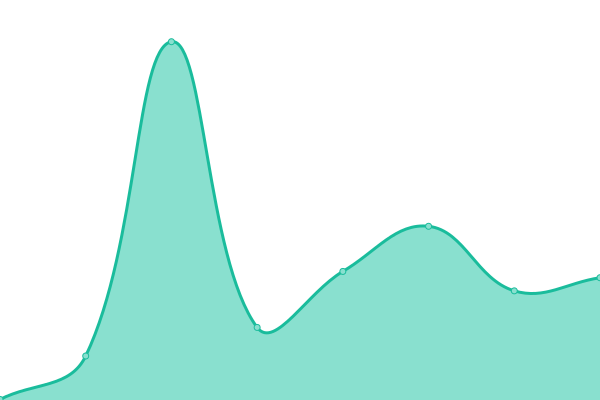 178ms
     
 | 

<a href="https://Haoqi7.github.io/uptime/history/games">100.00%</a>
    

|  [five-Chess](https://haoqi7.github.io/five-Chess/) | 🟩 Up | [five-chess.yml](https://github.com/Haoqi7/uptime/commits/HEAD/history/five-chess.yml) | 

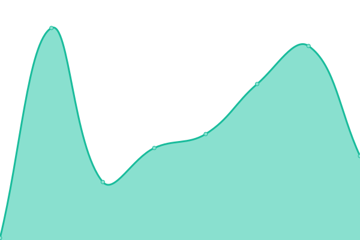 47ms
     
 | 

<a href="https://Haoqi7.github.io/uptime/history/five-chess">100.00%</a>
    

|  [Chinese-chess](https://haoqi7.github.io/Chinese-chess) | 🟩 Up | [chinese-chess.yml](https://github.com/Haoqi7/uptime/commits/HEAD/history/chinese-chess.yml) | 

 88ms
     
 | 

<a href="https://Haoqi7.github.io/uptime/history/chinese-chess">100.00%</a>
    

|  [catch-cat](https://haoqi7.github.io/catch-cat) | 🟩 Up | [catch-cat.yml](https://github.com/Haoqi7/uptime/commits/HEAD/history/catch-cat.yml) | 

 79ms
     
 | 

<a href="https://Haoqi7.github.io/uptime/history/catch-cat">100.00%</a>
    

|  [YesPlayMusic](https://music.wasenk.cf/) | 🟩 Up | [yes-play-music.yml](https://github.com/Haoqi7/uptime/commits/HEAD/history/yes-play-music.yml) | 

 258ms
     
 | 

<a href="https://Haoqi7.github.io/uptime/history/yes-play-music">100.00%</a>
    

|  [BiYingWallPaper](https://haoqi7.github.io/BiYingWallPaper/) | 🟩 Up | [bi-ying-wall-paper.yml](https://github.com/Haoqi7/uptime/commits/HEAD/history/bi-ying-wall-paper.yml) | 

 69ms
     
 | 

<a href="https://Haoqi7.github.io/uptime/history/bi-ying-wall-paper">100.00%</a>
    

|  [GitHub文件加速](https://git.haoqiyong.cf/) | 🟩 Up | [git-hub.yml](https://github.com/Haoqi7/uptime/commits/HEAD/history/git-hub.yml) | 

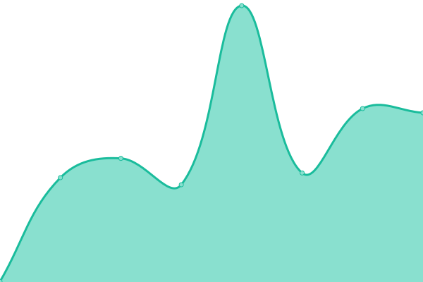 393ms
     
 | 

<a href="https://Haoqi7.github.io/uptime/history/git-hub">100.00%</a>
    

|  [OneLine Tool](https://haoqi7.github.io/online-tools/) | 🟩 Up | [one-line-tool.yml](https://github.com/Haoqi7/uptime/commits/HEAD/history/one-line-tool.yml) | 

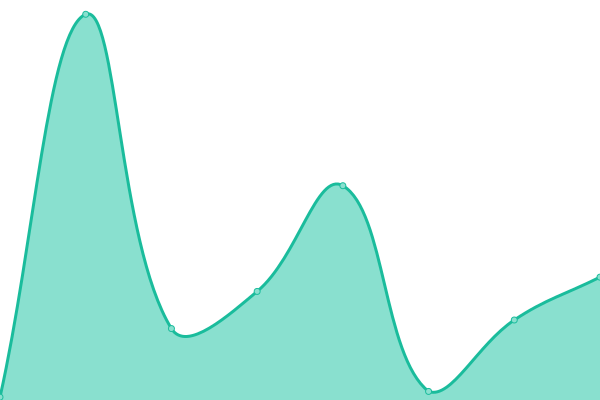 76ms
     
 | 

<a href="https://Haoqi7.github.io/uptime/history/one-line-tool">100.00%</a>
    

|  [API代理](https://proxy.haoqiyun.tk/) | 🟩 Up | [api.yml](https://github.com/Haoqi7/uptime/commits/HEAD/history/api.yml) | 

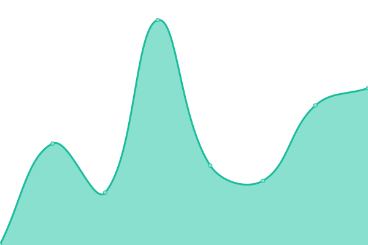 243ms
     
 | 

<a href="https://Haoqi7.github.io/uptime/history/api">100.00%</a>
    

|  [rsshub](https://rss.wasenk.cf/) | 🟩 Up | [rsshub.yml](https://github.com/Haoqi7/uptime/commits/HEAD/history/rsshub.yml) | 

 3166ms
     
 | 

<a href="https://Haoqi7.github.io/uptime/history/rsshub">100.00%</a>
    

|  [Translate](https://translate.wasenk.cf/) | 🟩 Up | [translate.yml](https://github.com/Haoqi7/uptime/commits/HEAD/history/translate.yml) | 

 238ms
     
 | 

<a href="https://Haoqi7.github.io/uptime/history/translate">100.00%</a>
    

|  [TXT-convert](https://haoqiyung.github.io/web-txt-convert/) | 🟩 Up | [txt-convert.yml](https://github.com/Haoqi7/uptime/commits/HEAD/history/txt-convert.yml) | 

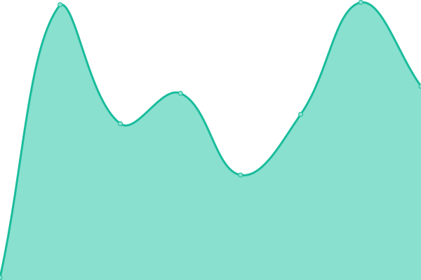 86ms
     
 | 

<a href="https://Haoqi7.github.io/uptime/history/txt-convert">100.00%</a>
    

|  [Ipfs](https://haoqiyung.github.io/ipfs/) | 🟩 Up | [ipfs.yml](https://github.com/Haoqi7/uptime/commits/HEAD/history/ipfs.yml) | 

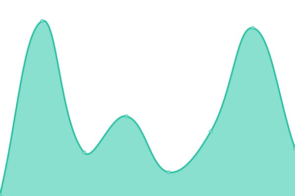 46ms
     
 | 

<a href="https://Haoqi7.github.io/uptime/history/ipfs">100.00%</a>
    

<!--end: status pages-->

[**Visit our status website →**](https://Haoqi7.github.io/uptime)

## 📄 License

- Code: [MIT](./LICENSE) © [Haoqi7](https://Haoqi7.github.io/uptime)
- Data in the `./history` directory: [Open Database License](https://opendatacommons.org/licenses/odbl/1-0/)
