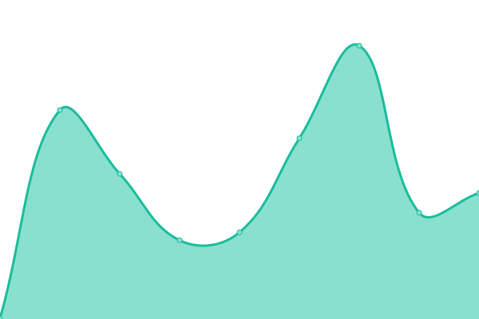
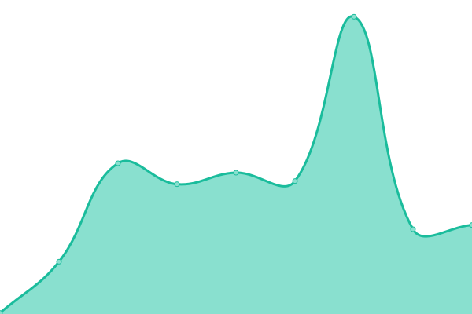
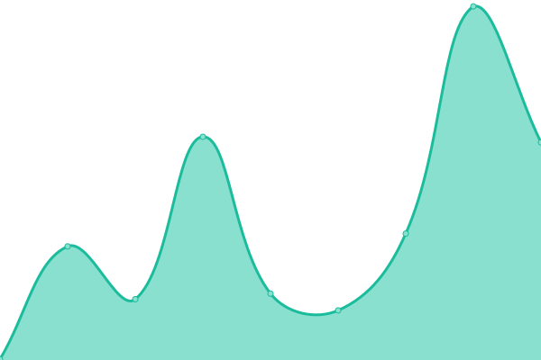
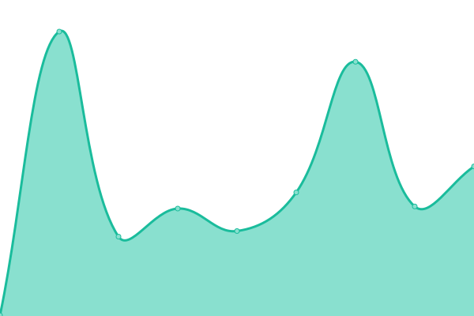

# [📈 Live Status](https://Haoqi7.github.io/uptime): <!--live status--> **🟧 Partial outage**

This repository contains the open-source uptime monitor and status page for [Haoqi7](https://Haoqi7.github.io/uptime), powered by [Up time](https://github.com/upptime/upptime).

With [Upptime](https://upptime.js.org), you can get your own unlimited and free uptime monitor and status page, powered entirely by a GitHub repository. We use [Issues](https://github.com/Haoqi7/uptime/issues) as incident reports, [Actions](https://github.com/Haoqi7/uptime/actions) as uptime monitors, and [Pages](https://Haoqi7.github.io/uptime) for the status page.

<!--start: status pages-->
<!-- This summary is generated by Upptime (https://github.com/upptime/upptime) -->
<!-- Do not edit this manually, your changes will be overwritten -->
<!-- prettier-ignore -->
| URL | Status | History | Response Time | Uptime |
| --- | ------ | ------- | ------------- | ------ |
|  [Let's Cook](https://cook.wasenk.cf/) | 🟥 Down | [let-s-cook.yml](https://github.com/Haoqi7/uptime/commits/HEAD/history/let-s-cook.yml) | 

 451ms
     
 | 

<a href="https://Haoqi7.github.io/uptime/history/let-s-cook">86.33%</a>
    

|  [File Transfer](https://code.haoqiyong.cf/) | 🟥 Down | [file-transfer.yml](https://github.com/Haoqi7/uptime/commits/HEAD/history/file-transfer.yml) | 

 845ms
     
 | 

<a href="https://Haoqi7.github.io/uptime/history/file-transfer">0.00%</a>
    

|  [File文件传递柜](https://file.haoda7.repl.co) | 🟥 Down | [file.yml](https://github.com/Haoqi7/uptime/commits/HEAD/history/file.yml) | 

 423ms
     
 | 

<a href="https://Haoqi7.github.io/uptime/history/file">0.00%</a>
    

|  [Drop](https://drop.hao77.repl.co/) | 🟥 Down | [drop.yml](https://github.com/Haoqi7/uptime/commits/HEAD/history/drop.yml) | 

 399ms
     
 | 

<a href="https://Haoqi7.github.io/uptime/history/drop">0.00%</a>
    

|  [Note便签](https://note.haoqiyun.tk/) | 🟥 Down | [note.yml](https://github.com/Haoqi7/uptime/commits/HEAD/history/note.yml) | 

 117ms
     
 | 

<a href="https://Haoqi7.github.io/uptime/history/note">83.56%</a>
    

|  [Bill账单](https://bill.wasenk.cf/) | 🟥 Down | [bill.yml](https://github.com/Haoqi7/uptime/commits/HEAD/history/bill.yml) | 

 315ms
     
 | 

<a href="https://Haoqi7.github.io/uptime/history/bill">86.00%</a>
    

|  [All网盘搜索](https://search.haoqiyun.tk/) | 🟥 Down | [all.yml](https://github.com/Haoqi7/uptime/commits/HEAD/history/all.yml) | 

 158ms
     
 | 

<a href="https://Haoqi7.github.io/uptime/history/all">83.56%</a>
    

|  [One网盘](https://pan.haoqiyun.tk/) | 🟥 Down | [one.yml](https://github.com/Haoqi7/uptime/commits/HEAD/history/one.yml) | 

 5589ms
     
 | 

<a href="https://Haoqi7.github.io/uptime/history/one">83.56%</a>
    

|  [Google Search](https://google.haoqiyun.tk/) | 🟥 Down | [google-search.yml](https://github.com/Haoqi7/uptime/commits/HEAD/history/google-search.yml) | 

 1439ms
     
 | 

<a href="https://Haoqi7.github.io/uptime/history/google-search">83.56%</a>
    

|  [Typecho博客](https://blog.haoqiyong.cf/) | 🟥 Down | [typecho.yml](https://github.com/Haoqi7/uptime/commits/HEAD/history/typecho.yml) | 

 612ms
     
 | 

<a href="https://Haoqi7.github.io/uptime/history/typecho">0.00%</a>
    

|  [Butterfly博客](https://haoqiyun.tk/) | 🟥 Down | [butterfly.yml](https://github.com/Haoqi7/uptime/commits/HEAD/history/butterfly.yml) | 

 123ms
     
 | 

<a href="https://Haoqi7.github.io/uptime/history/butterfly">83.56%</a>
    

|  [Matery博客](https://haoqiyung.github.io/) | 🟩 Up | [matery.yml](https://github.com/Haoqi7/uptime/commits/HEAD/history/matery.yml) | 

 85ms
     
 | 

<a href="https://Haoqi7.github.io/uptime/history/matery">100.00%</a>
    

|  [Rabbit博客](https://haoqi7.github.io/) | 🟩 Up | [rabbit.yml](https://github.com/Haoqi7/uptime/commits/HEAD/history/rabbit.yml) | 

 61ms
     
 | 

<a href="https://Haoqi7.github.io/uptime/history/rabbit">100.00%</a>
    

|  [NAS-state](https://nas-state.vercel.app/) | 🟩 Up | [nas-state.yml](https://github.com/Haoqi7/uptime/commits/HEAD/history/nas-state.yml) | 

 80ms
     
 | 

<a href="https://Haoqi7.github.io/uptime/history/nas-state">100.00%</a>
    

|  [My文档](https://wasenk.cf) | 🟥 Down | [my.yml](https://github.com/Haoqi7/uptime/commits/HEAD/history/my.yml) | 

 715ms
     
 | 

<a href="https://Haoqi7.github.io/uptime/history/my">85.68%</a>
    

|  [Chinese诗歌](https://haoqi7.github.io/poetry/) | 🟩 Up | [chinese.yml](https://github.com/Haoqi7/uptime/commits/HEAD/history/chinese.yml) | 

 30ms
     
 | 

<a href="https://Haoqi7.github.io/uptime/history/chinese">100.00%</a>
    

|  [EverydayNews](https://haoqi7.github.io/EverydayNews) | 🟩 Up | [everyday-news.yml](https://github.com/Haoqi7/uptime/commits/HEAD/history/everyday-news.yml) | 

 37ms
     
 | 

<a href="https://Haoqi7.github.io/uptime/history/everyday-news">100.00%</a>
    

|  [Day's早报](https://news.haoqiyun.tk/) | 🟥 Down | [day-s.yml](https://github.com/Haoqi7/uptime/commits/HEAD/history/day-s.yml) | 

 143ms
     
 | 

<a href="https://Haoqi7.github.io/uptime/history/day-s">83.56%</a>
    

|  [Weibo热搜榜](https://haoqi7.github.io/weibo-search/) | 🟩 Up | [weibo.yml](https://github.com/Haoqi7/uptime/commits/HEAD/history/weibo.yml) | 

 30ms
     
 | 

<a href="https://Haoqi7.github.io/uptime/history/weibo">100.00%</a>
    

|  [Chatgpt](https://cs.haoqiyong.cf/) | 🟥 Down | [chatgpt.yml](https://github.com/Haoqi7/uptime/commits/HEAD/history/chatgpt.yml) | 

 272ms
     
 | 

<a href="https://Haoqi7.github.io/uptime/history/chatgpt">0.00%</a>
    

|  [Online reader](https://reader.hao77.repl.co/) | 🟥 Down | [online-reader.yml](https://github.com/Haoqi7/uptime/commits/HEAD/history/online-reader.yml) | 

 472ms
     
 | 

<a href="https://Haoqi7.github.io/uptime/history/online-reader">0.00%</a>
    

|  [Nav导航网站](https://navi.vercel.app/) | 🟩 Up | [nav.yml](https://github.com/Haoqi7/uptime/commits/HEAD/history/nav.yml) | 

 62ms
     
 | 

<a href="https://Haoqi7.github.io/uptime/history/nav">100.00%</a>
    

|  [Learn Only导航](https://nav.wasenk.cf/) | 🟥 Down | [learn-only.yml](https://github.com/Haoqi7/uptime/commits/HEAD/history/learn-only.yml) | 

 403ms
     
 | 

<a href="https://Haoqi7.github.io/uptime/history/learn-only">85.93%</a>
    

|  [Games合集](https://game.haoqiyun.tk/) | 🟥 Down | [games.yml](https://github.com/Haoqi7/uptime/commits/HEAD/history/games.yml) | 

 156ms
     
 | 

<a href="https://Haoqi7.github.io/uptime/history/games">83.56%</a>
    

|  [five-Chess](https://haoqi7.github.io/five-Chess/) | 🟩 Up | [five-chess.yml](https://github.com/Haoqi7/uptime/commits/HEAD/history/five-chess.yml) | 

 38ms
     
 | 

<a href="https://Haoqi7.github.io/uptime/history/five-chess">100.00%</a>
    

|  [Chinese-chess](https://haoqi7.github.io/Chinese-chess) | 🟩 Up | [chinese-chess.yml](https://github.com/Haoqi7/uptime/commits/HEAD/history/chinese-chess.yml) | 

 43ms
     
 | 

<a href="https://Haoqi7.github.io/uptime/history/chinese-chess">100.00%</a>
    

|  [catch-cat](https://haoqi7.github.io/catch-cat) | 🟩 Up | [catch-cat.yml](https://github.com/Haoqi7/uptime/commits/HEAD/history/catch-cat.yml) | 

 42ms
     
 | 

<a href="https://Haoqi7.github.io/uptime/history/catch-cat">100.00%</a>
    

|  [YesPlayMusic](https://music.wasenk.cf/) | 🟥 Down | [yes-play-music.yml](https://github.com/Haoqi7/uptime/commits/HEAD/history/yes-play-music.yml) | 

 362ms
     
 | 

<a href="https://Haoqi7.github.io/uptime/history/yes-play-music">85.92%</a>
    

|  [BiYingWallPaper](https://haoqi7.github.io/BiYingWallPaper/) | 🟩 Up | [bi-ying-wall-paper.yml](https://github.com/Haoqi7/uptime/commits/HEAD/history/bi-ying-wall-paper.yml) | 

 47ms
     
 | 

<a href="https://Haoqi7.github.io/uptime/history/bi-ying-wall-paper">100.00%</a>
    

|  [GitHub文件加速](https://git.haoqiyong.cf/) | 🟥 Down | [git-hub.yml](https://github.com/Haoqi7/uptime/commits/HEAD/history/git-hub.yml) | 

 728ms
     
 | 

<a href="https://Haoqi7.github.io/uptime/history/git-hub">86.88%</a>
    

|  [OneLine Tool](https://haoqi7.github.io/online-tools/) | 🟩 Up | [one-line-tool.yml](https://github.com/Haoqi7/uptime/commits/HEAD/history/one-line-tool.yml) | 

 35ms
     
 | 

<a href="https://Haoqi7.github.io/uptime/history/one-line-tool">100.00%</a>
    

|  [API代理](https://proxy.haoqiyun.tk/) | 🟥 Down | [api.yml](https://github.com/Haoqi7/uptime/commits/HEAD/history/api.yml) | 

 138ms
     
 | 

<a href="https://Haoqi7.github.io/uptime/history/api">83.55%</a>
    

|  [rsshub](https://rss.wasenk.cf/) | 🟥 Down | [rsshub.yml](https://github.com/Haoqi7/uptime/commits/HEAD/history/rsshub.yml) | 

 3707ms
     
 | 

<a href="https://Haoqi7.github.io/uptime/history/rsshub">85.92%</a>
    

|  [Translate](https://translate.wasenk.cf/) | 🟥 Down | [translate.yml](https://github.com/Haoqi7/uptime/commits/HEAD/history/translate.yml) | 

 374ms
     
 | 

<a href="https://Haoqi7.github.io/uptime/history/translate">86.27%</a>
    

|  [Deepl](https://deep.haoda.repl.co/) | 🟥 Down | [deepl.yml](https://github.com/Haoqi7/uptime/commits/HEAD/history/deepl.yml) | 

 355ms
     
 | 

<a href="https://Haoqi7.github.io/uptime/history/deepl">0.00%</a>
    

|  [Deeplx](https://deep.haoda7.repl.co/) | 🟥 Down | [deeplx.yml](https://github.com/Haoqi7/uptime/commits/HEAD/history/deeplx.yml) | 

 205ms
     
 | 

<a href="https://Haoqi7.github.io/uptime/history/deeplx">0.00%</a>
    

|  [fy](https://fy.haoda.repl.co/) | 🟥 Down | [fy.yml](https://github.com/Haoqi7/uptime/commits/HEAD/history/fy.yml) | 

 292ms
     
 | 

<a href="https://Haoqi7.github.io/uptime/history/fy">0.00%</a>
    

|  [Bing Straslate API](https://fy.haoda7.repl.co/) | 🟥 Down | [bing-straslate-api.yml](https://github.com/Haoqi7/uptime/commits/HEAD/history/bing-straslate-api.yml) | 

 203ms
     
 | 

<a href="https://Haoqi7.github.io/uptime/history/bing-straslate-api">0.00%</a>
    

|  [TXT-convert](https://haoqiyung.github.io/web-txt-convert/) | 🟩 Up | [txt-convert.yml](https://github.com/Haoqi7/uptime/commits/HEAD/history/txt-convert.yml) | 

 51ms
     
 | 

<a href="https://Haoqi7.github.io/uptime/history/txt-convert">100.00%</a>
    

|  [Ipfs](https://haoqiyung.github.io/ipfs/) | 🟩 Up | [ipfs.yml](https://github.com/Haoqi7/uptime/commits/HEAD/history/ipfs.yml) | 

 34ms
     
 | 

<a href="https://Haoqi7.github.io/uptime/history/ipfs">100.00%</a>
    

|  [cs](https://cs.haoqiyong.cf) | 🟥 Down | [cs.yml](https://github.com/Haoqi7/uptime/commits/HEAD/history/cs.yml) | 

 40ms
     
 | 

<a href="https://Haoqi7.github.io/uptime/history/cs">0.00%</a>
    

|  [count不蒜子](https://count.haoqi7.repl.co/) | 🟥 Down | [count.yml](https://github.com/Haoqi7/uptime/commits/HEAD/history/count.yml) | 

 733ms
     
 | 

<a href="https://Haoqi7.github.io/uptime/history/count">0.00%</a>
    

<!--end: status pages-->

[**Visit our status website →**](https://Haoqi7.github.io/uptime)

## 📄 License

- Code: [MIT](./LICENSE) © [Haoqi7](https://Haoqi7.github.io/uptime)
- Data in the `./history` directory: [Open Database License](https://opendatacommons.org/licenses/odbl/1-0/)
